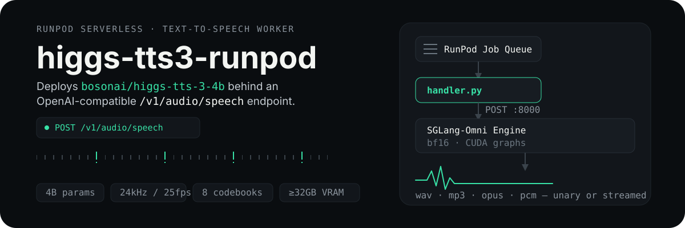
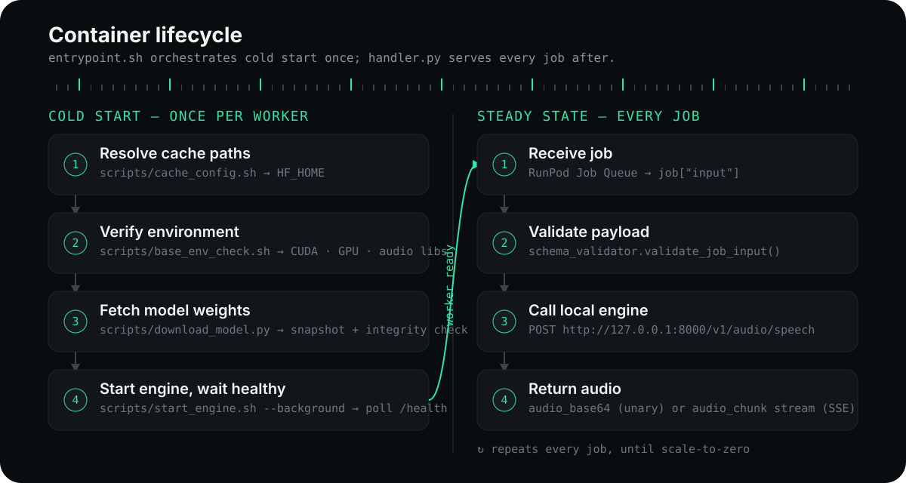

<p align="center">
  
</p>

<p align="center">
  <a href="https://huggingface.co/bosonai/higgs-tts-3-4b"></a>
  <a href="https://github.com/sgl-project/sglang-omni"></a>
  
  
</p>

A [RunPod Serverless](https://www.runpod.io/serverless-gpu) worker that serves **Higgs TTS 3 (4B)** — a 4B-parameter autoregressive text-to-speech model — behind an OpenAI-compatible `/v1/audio/speech` endpoint. [SGLang-Omni](https://github.com/sgl-project/sglang-omni) runs the inference engine inside the worker container; a thin Python `handler.py` bridges RunPod's job queue to it and returns synthesized audio, unary or streamed.

## What it does

- **Zero-shot voice cloning** — upload a reference audio clip (base64) + transcript inline, no fine-tuning and no pre-staged files required.
- **Inline delivery control** — emotion, style, prosody, and sound-effect tags mid-utterance (`<|emotion:elation|>`, `<|sfx:laughter|>Haha`).
- **Streaming or unary audio** — Server-Sent Events for low time-to-first-audio, or a single base64 payload.
- **Cold-start-aware caching** — model weights persist on a RunPod Network Volume so restarts don't re-download ~8GB of weights.

## Quickstart

```bash
# 1. Build and push the worker image
docker build -t registry/higgs-tts3-runpod:latest .
docker push registry/higgs-tts3-runpod:latest

# 2. Create the RunPod Serverless endpoint
#    deploy/runpod_template.json has the GPU, Network Volume, and env var
#    defaults — import it via the RunPod console or `runpodctl`.
#    Then set Advanced settings -> Model = bosonai/higgs-tts-3-4b so RunPod
#    pre-stages the weights before the worker starts (unbilled download
#    wait) — this is a console-only setting, see Configuration below.

# 3. Call it
curl -s https://api.runpod.ai/v2/<ENDPOINT_ID>/runsync \
  -H "Authorization: Bearer $RUNPOD_API_KEY" \
  -H "Content-Type: application/json" \
  -d '{
        "input": {
          "input": "Hello from Higgs TTS 3, running on RunPod.",
          "voice": "default",
          "response_format": "wav"
        }
      }'
```

A gated `bosonai/higgs-tts-3-4b` requires `HF_TOKEN` set on the endpoint; see [Configuration](#configuration).

## How it works

<p align="center">
  
</p>

`handler.py` is the container's `CMD` — there is no bash entrypoint. RunPod's setup validator and worker supervisor need to see a live `runpod`-importing Python process almost immediately, so `handler.py` runs its own **one-time cold-start bootstrap at module scope**: verify CUDA/GPU/audio libraries; check `/runpod-volume/huggingface-cache/hub/models--bosonai--higgs-tts-3-4b/` for an already-cached snapshot (RunPod's own model cache, or a prior worker's download) and skip straight to the engine on a hit — only downloading from Hugging Face when nothing is cached; launch `sgl-omni serve` as a child process; and poll `/health` until it's ready — all before `runpod.serverless.start()` is ever called. Only then does it register with RunPod and, for **every job**, validate the payload, forward it to the local engine over HTTP, and relay the audio response back — as a single base64 payload or an SSE-style generator of chunks.

The engine only ever talks to `127.0.0.1:8000`; RunPod's job queue is the only external surface. `RUNPOD_SKIP_GPU_CHECK` / `RUNPOD_SKIP_AUTO_SYSTEM_CHECKS` are set on the image because the RunPod SDK's own post-model-load fitness checks otherwise false-positive OOM on this worker's VRAM footprint.

## API

`handler.py` accepts the same fields as OpenAI's `/v1/audio/speech`, wrapped in RunPod's job envelope:

```json
{
  "input": {
    "input": "Text to synthesize.",
    "voice": "default",
    "references": [
      { "audio_base64": "<base64-encoded audio bytes>", "text": "Reference transcript.", "audio_format": "wav" }
    ],
    "response_format": "wav",
    "speed": 1.0,
    "temperature": 0.8,
    "top_k": 50,
    "stream": false
  }
}
```

| Field | Type | Default | Notes |
| --- | --- | --- | --- |
| `input` | string | — | required, ≤10,000 characters |
| `voice` | string | — | either `voice` or `references` is required |
| `references` | array | `[]` | up to 4 `{audio_base64, text, audio_format}` clips for zero-shot cloning |
| `response_format` | string | `"wav"` | one of `wav`, `mp3`, `opus`, `pcm` |
| `speed` | number | `1.0` | |
| `temperature` | number | `0.8` | |
| `top_k` | integer | `50` | |
| `stream` | boolean | `false` | SSE chunk stream instead of one payload |

Unary responses return `{"audio_base64": "...", "response_format": "wav", "sample_rate": 24000}`. Streaming responses yield `{"audio_chunk": "...", "done": false}` events, ending with `done: true`; both modes surface engine failures as `{"error": "..."}` (invalid input, VRAM exhaustion, or engine timeout).

### Voice cloning with an uploaded reference clip

`references[].audio_base64` is the raw audio itself, base64-encoded — callers upload it inline; the worker never reads it from the RunPod Network Volume (that volume only holds the cached model weights). Encode a local clip and inline it into the job payload:

```bash
REF_B64=$(base64 -w0 my_voice_sample.wav)

curl -s https://api.runpod.ai/v2/<ENDPOINT_ID>/runsync \
  -H "Authorization: Bearer $RUNPOD_API_KEY" \
  -H "Content-Type: application/json" \
  -d '{
        "input": {
          "input": "This will be spoken in the cloned voice.",
          "references": [
            { "audio_base64": "'"$REF_B64"'", "text": "Transcript of my_voice_sample.wav", "audio_format": "wav" }
          ]
        }
      }'
```

`handler.py` decodes each reference to a short-lived local temp file for the engine call and deletes it once the job finishes. Reference audio is capped at 2MB decoded per clip (~41s of 24kHz/16-bit/mono WAV) and 6MB decoded combined across up to 4 clips — sized to stay well under RunPod's [`/run` 10MB / `/runsync` 20MB payload limits](https://docs.runpod.io/serverless/workers/handler-functions#payload-limits) once base64-inflated.

### Inline control tags

Delivery is controllable mid-sentence with `<|category:value|>` tags — emotion and style at the start of the utterance, sound effects and pauses inline:

```text
<|emotion:elation|>We shipped it! <|sfx:laughter|>Haha, finally.
<|style:whispering|>Keep it down<|prosody:pause|>they're still listening.
```

Supported categories: `emotion` (21 values, e.g. `elation`, `determination`, `sadness`), `style` (`singing`, `shouting`, `whispering`), `prosody` (speed/pitch/expressiveness + `pause` / `long_pause`), and `sfx` (`laughter`, `cough`, `sigh`, `sneeze`, and more, each paired with matching onomatopoeia).

## Performance

Reference concurrency sweep on an A100 80GB (`tests/benchmark_results.json`; regenerate against a live engine with `python3 tests/test_local.py --concurrency-sweep`):

| Concurrency | Throughput (req/s) | Mean latency | Real-time factor |
| ---: | ---: | ---: | ---: |
| 1 | 1.19 | 0.84s | 0.336 |
| 2 | 1.90 | 0.98s | 0.210 |
| 4 | 2.47 | 1.41s | 0.162 |
| 8 | 2.72 | 2.51s | 0.147 |

Lower real-time factor is better (< 1.0 means faster than real-time playback).

## Configuration

| Variable | Default | Purpose |
| --- | --- | --- |
| `MODEL_REPO_ID` | `bosonai/higgs-tts-3-4b` | Hugging Face repo to serve |
| `MODEL_REVISION` | `main` | Model revision/branch |
| `HF_TOKEN` | — | Required if the model repo is gated |
| `HF_HOME` | `/runpod-volume/huggingface-cache` | Weight cache root; the actual snapshot lives under `HF_HOME/hub/...`, matching both Hugging Face's own convention and RunPod's model-cache layout |
| `BAKE_INTO_IMAGE` | `0` | Set to `1` to cache weights inside the image instead of a Network Volume |
| `SKIP_MODEL_DOWNLOAD` | `0` | Set to `1` if weights are already present at `HF_HOME` |
| `ENGINE_READY_TIMEOUT_SECONDS` | `600` | How long `handler.py`'s bootstrap waits for `sgl-omni serve` to report healthy before failing the worker |
| `RUNPOD_SKIP_GPU_CHECK` | `true` | Set on the image; skips a RunPod SDK fitness check that false-positive OOMs on this worker's VRAM footprint |
| `RUNPOD_SKIP_AUTO_SYSTEM_CHECKS` | `true` | Set on the image; same reason as above |
| `RUNPOD_INIT_TIMEOUT` | `1200` | Set on the image; RunPod kills a worker as unhealthy once cold start exceeds a 7-minute default, which a cache-miss cold start (network download + engine warm-up) here can exceed — this is the most common cause of "worker exited with exit code 1" with no logs |
| `MEM_FRACTION_STATIC` | `0.75` | Fraction of GPU memory `sgl-omni serve` reserves for weights + KV cache. Weights are only ~9.3GB bf16; SGLang's own default (~0.88) is sized for high concurrency and can overshoot on a real 32GB card, which often reports a bit under 32GiB via `nvidia-smi` (e.g. RTX 5090 reports ~31.8GiB) |

Hardware: NVIDIA GPU with **≥28GB VRAM** (32GB-class cards such as RTX 5090, or A100/H100/L40S for higher concurrency), CUDA 12.4, Python 3.12.

### Model caching (do this — it's the single biggest cold-start lever)

RunPod can pre-stage `bosonai/higgs-tts-3-4b` on the worker host **before the container even starts**, and that download wait isn't billed. This is a **console-only setting** (as of 2026-08-09 it isn't in the public REST v1 `POST /templates` or `POST /endpoints` schema, so it can't be set from `deploy/runpod_template.json`):

1. RunPod console → your endpoint → **Manage → Edit Endpoint** (or set it while creating a new one).
2. **Advanced settings → Model** → `bosonai/higgs-tts-3-4b`.
3. Add your Hugging Face token there too if the repo is gated.

`handler.py`'s bootstrap checks `/runpod-volume/huggingface-cache/hub/models--bosonai--higgs-tts-3-4b/` for a snapshot first and skips its own download entirely on a hit — whether that hit comes from RunPod's cache or a previous worker's run on the same Network Volume. Each endpoint supports exactly one cached model.

## Project layout

```text
.
├── Dockerfile              # final worker image (base env + engine + handler); CMD runs handler.py directly
├── handler.py               # RunPod serverless handler + cold-start bootstrap (no bash entrypoint)
├── schema_validator.py      # request/response validation
├── requirements.txt
├── scripts/
│   ├── base_env_check.sh    # CUDA / GPU / audio-lib sanity check (run non-fatally by handler.py's bootstrap)
│   ├── cache_config.sh      # resolves HF_HOME (network volume vs. baked); for local/manual runs
│   ├── download_model.py    # snapshot_download + integrity verification; imported directly by handler.py
│   └── start_engine.sh      # launches sgl-omni serve, polls /health; for local/manual runs
├── config/
│   └── engine_config.json   # engine runtime parameters
├── deploy/
│   └── runpod_template.json # RunPod Serverless endpoint template
└── tests/
    ├── test_local.py        # local handler simulation + concurrency sweep
    └── benchmark_results.json
```

## Local testing

`tests/test_local.py` calls `handler.handler()` directly — no RunPod queue needed. Importing `handler` runs the same cold-start bootstrap the container uses (env check, model download, engine launch + health poll), so it needs a GPU host either way. Two options:

```bash
# Option A — let handler.py bootstrap everything itself
python3 tests/test_local.py --concurrency-sweep

# Option B — pre-start the engine manually (bootstrap detects it's already
# healthy and skips launching a duplicate) and skip the redundant download
source scripts/cache_config.sh
scripts/start_engine.sh --background   # waits for /health before returning
SKIP_MODEL_DOWNLOAD=1 python3 tests/test_local.py --concurrency-sweep
```

This exercises plain synthesis, zero-shot cloning, SSE streaming, and inline control tags, then writes fresh numbers to `tests/benchmark_results.json`.

## Limitations

- Requires a CUDA GPU with ≥28GB VRAM — there is no CPU fallback.
- Each worker runs exactly one local engine instance; scaling happens across workers, not within one.
- `bosonai/higgs-tts-3-4b` may be gated on Hugging Face — set `HF_TOKEN` before first deploy.
- Cold start time depends on whether the Network Volume already has cached weights; the first worker to boot on a fresh volume pays the full download.
- Reference clips travel inline as base64 in the request body — keep them short (a few seconds); large clips inflate payload size and job latency.

## License

No `LICENSE` file is included yet — add one before distributing this worker publicly.
